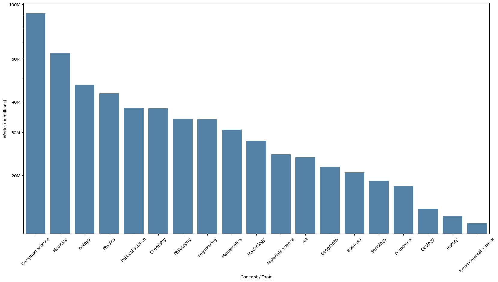
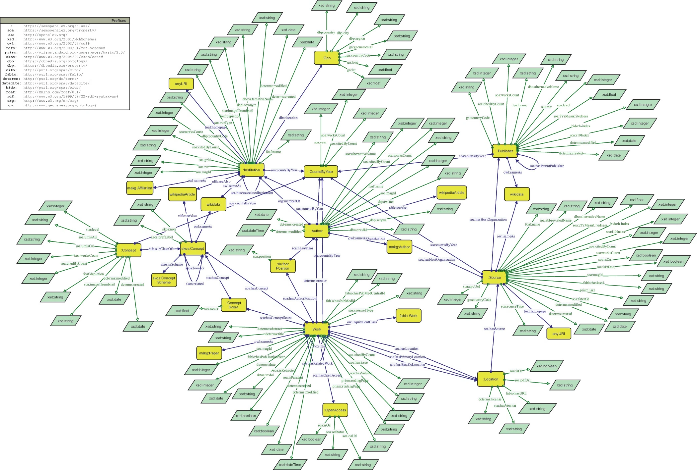

# OpenAlex - Redefining Scholarly Knowledge with Open Access Data

# What is OpenAlex?

- bibliographic catalogue of scientific papers, authors and institutions accessible in **open access**
- released in January 2022 by OurResearch (a U.S.-based non-profit) 
- name inspired by the Library of Alexandria

# What is OpenAlex?

- over 250M scholarly works from 250k sources
- linked to 90M disambiguated authors and 100k institutions
- graph database 
- base was data from Microsoft Academic Graph (MAG)

# What was Microsoft Academic Graph (MAG)?

- academic search engine for open access publications
- run by Microsoft Research from 2016 to the end of 2021
- primarily resource for sources in computer science
- open API made it possible for OpenAlex to merge data

# Where does OpenAlex get its data from?

- MAG was its most important source
- crossref, open scholarly data aggregator and registration agency for DOI
- others are: ORCID, DOAJ, ROR1

# How does OpenAlex structure the data?

- graph database
- nodes = scholarly entities
- edges = relationship between entities

# Entities in OpenAlex

# Entities in OpenAlex
| Entity      | Description |
| ----        | ------- |
| Works       | Scholarly documents like journal articles, books, datasets    |
| Authors     | People that created works     |
| Sources     | Where works are hosted (journals, confrences etc.)    |
| Institutions| Universities and other organizations to which authors are connected to|
| Topics      | Topics assigned to works     |
| Publishers  | Companies and organizations that distribute works    |
| Funders     | Organizations that fund research  |
| Location    | Locations that can be linked to works and sources |

# How does OpenAlex make the data accessible?

- CC0 license
- free to use web interface search engine
- Open REST-API
- downloadable data (Snapshot)

# How does OpenAlex guarantee Author disambiguation?

- OpenAlex's Author Name Disambiguation (AND) System
- algorithm that uses an author’s name, their publication record, their citation patterns, and (where available) their ORCID
- XGBoost-based model and iterative clustering for accurate grouping of authors

# What fields of science does OpenAlex cover?

# What is OpenAlex useful for?

- literature search
- used by universities to measure the progress of their research in-terms of publishing publications 

# Projects using OpenAlex

- Python + R libraries
- "Curtin Open Knowledge Initiative" dashboard
- SemOpenAlex

# SemOpenAlex

- knowledge graph with 26 billion RDF & RDF* triples
- ontology based on OpenAlex entities
- all URIs of SemOpenAlex are resolvable, which allows it to be part of the LOD Cloud
- researchable with SPARQL

# SemOpenAlex

# Why OpenAlex matters!
- promotes open access and transparency in scholarly research
- provides free, reusable data for research and academic analysis
- plays a role in advancing open science by reducing dependency on commercial databases

# Sources
 
- [OpenAlex Documentation, acessed 2024-11-02](https://docs.openalex.org)
- [OpenAlex Help Center, acessed 2024-11-02](https://help.openalex.org/hc/en-us)
- Färber, M., Lamprecht, D., Krause, J., Aung, L., Haase, P. (2023). SemOpenAlex: The Scientific Landscape in 26 Billion RDF Triples. In: Payne, T.R., et al. The Semantic Web – ISWC 2023. ISWC 2023. Lecture Notes in Computer Science, vol 14266. Springer, Cham. (https://doi.org/10.1007/978-3-031-47243-5_6)  
- [OpenAlex Name Disambiguation on GitHub, acessed 2024-11-02](https://github.com/ourresearch/openalex-name-disambiguation/tree/main/V3)

