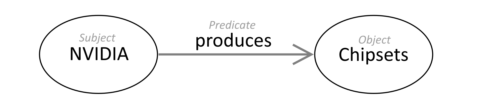
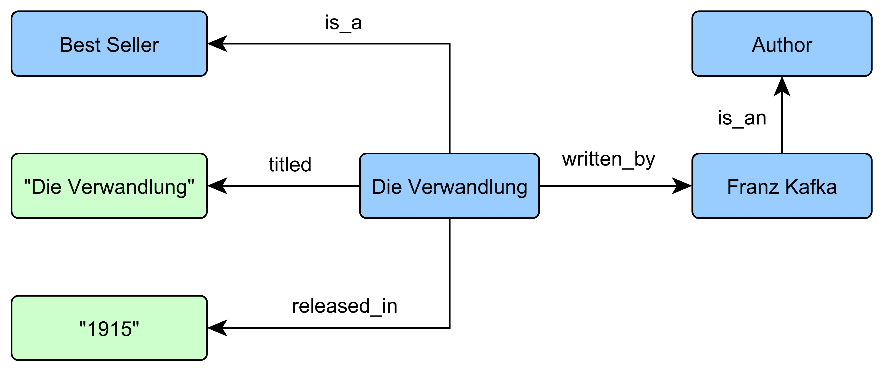
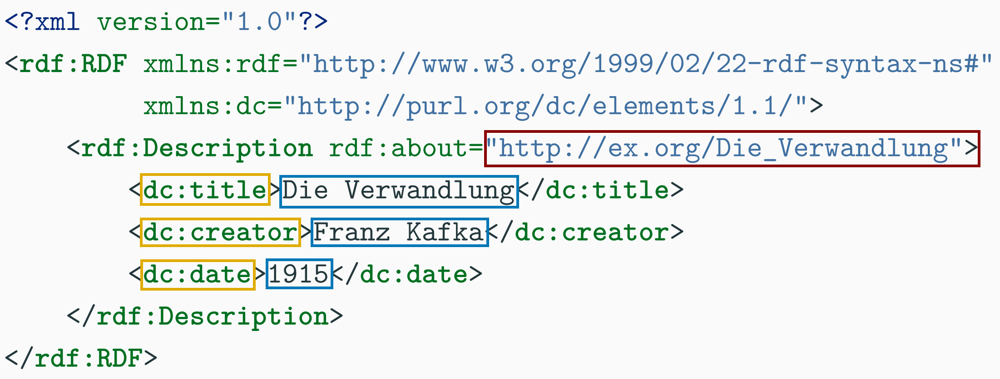
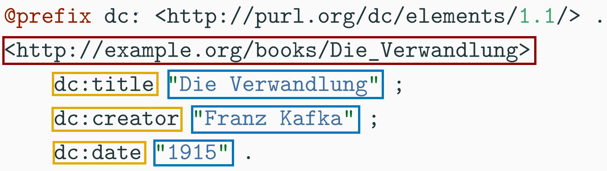

% Resource Description Framework (RDF)
% ***by* Lennard Feuerbach** 
% ***on the* 29th of October, 2024** 

---

# **Table of Contents**
1. Introduction
2. History
3. RDF Basics
4. RDF Syntaxes
5. RDF in Practice
6. Related topics
7. Conclusion
8. References

---

# 1. **Introduction** 

- **RDF** means Resource Description Framework
- Markup language to describe internet resources
- Creates logical statements about objects (resources/literals)
- Fundamental core technology of the **semantic web**
- Structures metadata for machine-readable interactions

---

# 2. **History**

- Predecessor was Meta Content Framework (MCF) in XML developed in 1995 
- RDF developed by W3C to structure web metadata, during the browser wars
- First RDF draft in August 1997 with an official release in 1999
- Two major updates throughout the years, most recent update in 2014

---

# 3. **RDF Basics**

## 3.1 **Triple Structure**
- RDF data uses **triples**: subject, predicate and object
- Totallity of triples forms a graph, called **RDF model**
- Subject and predicate are resources; Object can be resource or literal



---

# 3. **RDF Basics**

## 3.2 **Ressources and Literals**
- **Resources:** Identified by URIs; represent entities like people or relationships
- **Literals:** Specific values (e.g., strings, numbers) providing data, no references

&nbsp;

```
	Subject:    Lennard            | Subject:   Lennard
	Predicate:  hasFriend          | Predicate: hasAge
	Object:     Niclas  (Resource) | Object:    22  (Literal)
```

---

# 3. **RDF Basics**

### 3.3 **URIs**

- RDF resources must have a URI, a unique character string identifier
- URIs resemble URLs; URLs are specific URIs for web pages
- IRIs: Newer, broader URIs supporting more Unicode characters

```python
    # URI for a person resource, such as Lennard
    http://example.com/people/lennard

    # URI for a book resource
    http://example.com/books/978-3-16-148410-0
```

---
 
# 3. **RDF Basics**

### 3.4 **Example**



---


# 4. **RDF Syntaxes**

## 4.1 **RDF/XML**
- First W3C standard RDF format; less common due to complex syntax

{ width=90% height=55% }

---

# 4. **RDF Syntaxes**

## 4.2 **Turtle**
- User-friendly, readable format; uses prefixes for URIs and allows comments
- Ideal to use for hand-editing RDF due to its high human-readability

{ width=90% height=45% }

---

# 4. **RDF Syntaxes**

## 4.3 **Other Formats**
- **JSON-LD:** JSON format for linked data, easy integration with web apps
- **N-Triples:** Line-based text format for representing RDF triples
- **RDFa:** Embeds RDF in HTML/XML for enriched semantic content

---

# 5. **RDF in Practice**

## **Linked Open Data (LOD)**
- LOD is openly available data on the web, identified and linked by URIs
- It utilizes RDF to create semantic connections between data points

## **DBpedia**
- Transforms Wikipedia articles for the semantic web
- Data follows the RDF standard for structured information

## **Wikidata**
- Free knowledge base for structured data in RDF format
- Supports data linking and integration with other LOD sources

---

# 6. **Related topics**

## **RDF Schema (RDFS)**
- Extends RDF with classes and properties to structure data
- Defines classes `(rdfs:Class)` and hierarchies `(rdfs:subClassOf)`

## **SPARQL**
- Query language for retrieving/manipulating RDF data
- Enables pattern-based data access across diverse sources

```sql
    SELECT ?email WHERE {
      <http://ex.org/LennardFe> <http://ex.org/hasEmail> ?email.
    }
```

---

# 7. **Conclusion**

- **Foundational Framework:** Essential for linking data on the web
- **Synergism:** Enables seamless data exchange across systems
- **Machine-Readable:** Standardizes data semantics for machines
- **Rich Ecosystem:** Supports various applications in data management

---

# 8. **References**

- W3C, "RDF 1.1 Concepts and Abstract Syntax". Zugriff am 25.10.2024 [Online]. Link: https://www.w3.org/TR/rdf11-concepts/
- W3C, "Resource Description Framework (RDF) Model and Syntax Specification". Zugriff am 25.10.2024 [Online]. Link: https://www.w3.org/TR/PR-rdf-syntax/
- Krichel, Thomas. "The Semantic web and an introduction to RDF." (2002).
- Beckett, Dave, and Brian McBride. "RDF/XML syntax specification (revised)." W3C recommendation 10.2.3 (2004).
- Beckett, David, et al. "RDF 1.1 Turtle." World Wide Web Cons. (2014): S. 18-31.
- W3C, "RDF Schema 1.1". Zugriff am 27.10.2024 [Online]. Link: https://www.w3.org/TR/rdf-schema/