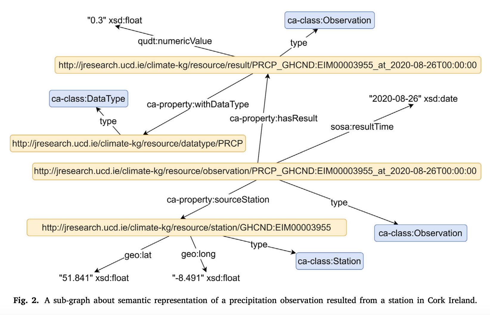
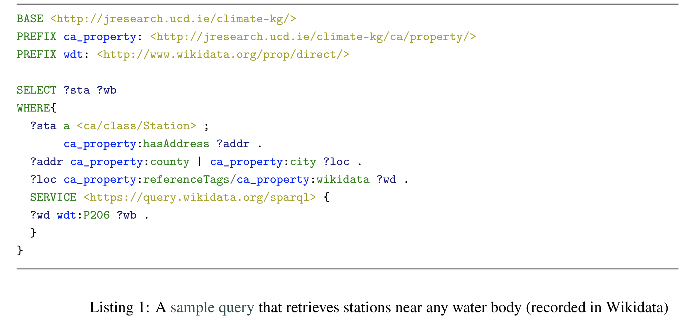

# Publication
## LinkClimate: An Interoperable Knowledge Graph Platform for Climate Data
Presenter: Shehroz Ahmed

18.11.2024

# Table of Contents

    
1. Introduction
2. Objectives
3. Data Sources
4. CA Ontology
5. Workflow
6. In Action
7. Usability Testing
8. Benefits and Application
9. Future Work

# Introduction

- Climate change is a pressing global issue that requires advanced tools to study its impacts.
- Climate data, such as temperature, precipitation, and wind, is collected globally but stored in disconnected systems.
- Current challenges:
    - Researchers struggle to integrate data from multiple sources.
    - Cross-domain analysis (linking climate data with geography or human activities) is difficult.
- **LinkClimate** aims to overcome these challenges by creating a unified knowledge graph for integrated data analysis.

# Objectives

- An open online KG populated with NOAA climate data as a
means of providing context to data, thus increasing the platform’s explainability, which is often lacking in many automation systems.
- Integration of heterogeneous data sources e.g. climate, with geographic (OpenStreetMap) and encyclopedic (Wikidata) source through use of Linked Data Principles.
- Regular, automated synchronization of heterogeneous data into
the KG.
- A Web interface to assist climate researchers in exploring and
using the platform.

# Data Sources

- **NOAA (National Oceanic and Atmospheric Administration)**:
  - Provides historical daily climate data, including meteorological variables like temperature, precipitation, and wind.
- **OpenStreetMap (OSM)**:
  - Supplies geographic data such as weather station locations, boundaries, and nearby geographic features.
- **Wikidata**:
  - Offers encyclopedic information, linking geographic features with detailed context like administrative regions, nearby water bodies, and more.

# Climate Analysis Ontology (CA Ontology):
- Climate data from NOAA APIs (e.g., temperature, precipitation, wind) is inherently unstructured or loosely structured.
- CA Ontology provides a schema that transforms this data into a structured format with meaningful relationships. For example:
    - A weather station (class: Station) records temperature data (class: Observation) at a specific time (property: resultTime) and location (property: isLocatedIn).
- CA Ontology aligns data from different sources by using common vocabularies. This ensures that datasets from NOAA, OpenStreetMap, and Wikidata can be integrated seamlessly.

# Workflow

1. Data is requested from NOAA's APIs.
2. The CA Ontology is then used to structure and introduce semantics to the raw data.
3. OpenStreetMap-based geographic information, such as counties and cities of climate stations, is integrated to enrich the KG.
4. The data is stored as RDF triples in a triple-store database. 
5. Data is accessible via web endpoints. Also, a SPARQL endpoint allows users to query the data.

# In Action - Web Endpoint

# In Action - SPARQL 

# Usability Testing

- A web interface was developed for non-expert users, featuring an intuitive GUI and SPARQL query guidance.
- Usability testing involved asking 7 questions from 31 participants, with positive feedback.
- Average scores for usability questions ranged from 3.94 to 4.33 (on a 5-point scale).
- Users found the platform effective for querying climate data, though some suggested improvements for the interface.

# Benefits and Applications:

- **For Researchers**:
  - Reduces the time and effort required to integrate diverse datasets.
  - Simplifies complex queries across multiple domains.
- **For Policy Makers**:
  - Supports evidence-based decision-making with data-driven insights.
- **Future Applications**:
  - Expanding into related domains like air quality, oceanography, and urban development.
  - Enabling large-scale climate impact studies across regions.

# Challenges and Future Work
- **Challenges**:
    - Managing the complexity of integrating diverse data types (e.g., satellite data, socio-economic indicators).
    - Ensuring consistent data quality and maintaining up-to-date information.
- **Future Enhancements**:
    - Extend the CA Ontology to include more data types like remote sensing and NetCDF-formatted data.
    - Develop a more user-friendly web interface to make the platform accessible to non-technical users.
    - Integrate GeoSPARQL for better spatial queries and analysis.
